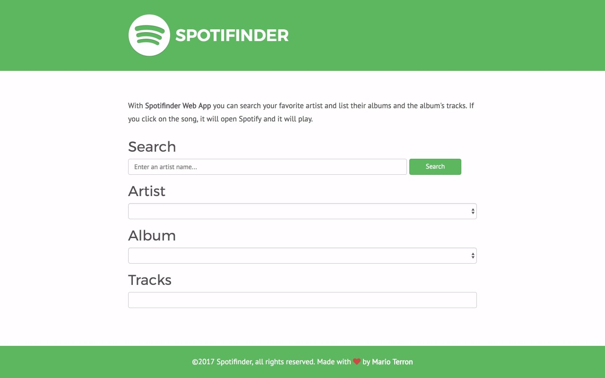

# [Spotifinder](https://marioterron.github.io/spotifinder-angular) #

## Description ##

This repository contains a Web App made with HTML, CSS and Angular in the [Skylab Coders Academy](http://www.skylabcoders.com/es/) Full Stack Web Development Bootcamp.

**Spotifinder** use the [Spotify API](https://developer.spotify.com/web-api/) to search your favorite artists and list their albums and the album's tracks. If you click on the song, it will open Spotify and it will play.

[Here](https://github.com/juanmaguitar/exercises-javascript/tree/master/04-jquery-spotify-API) is the repository of the initial version
in jQuery and [here](https://marioterron.github.io/spotifinder-angular) you can test the version in Angular.

